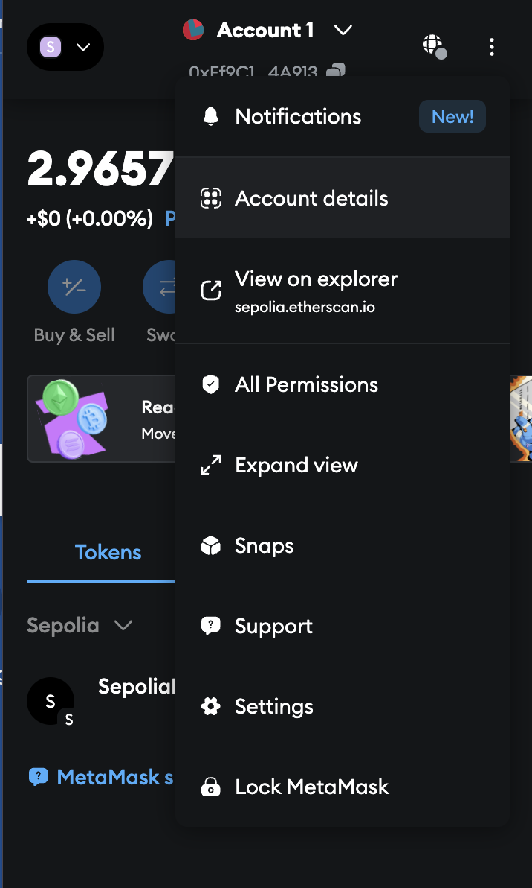
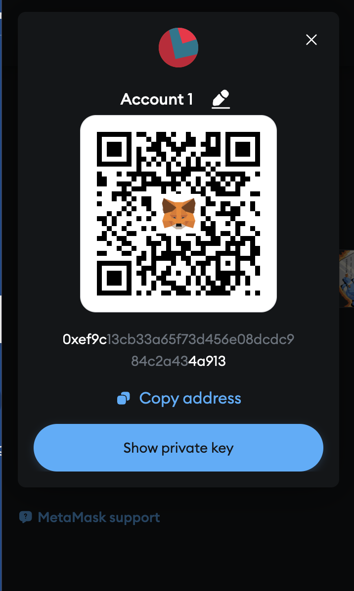
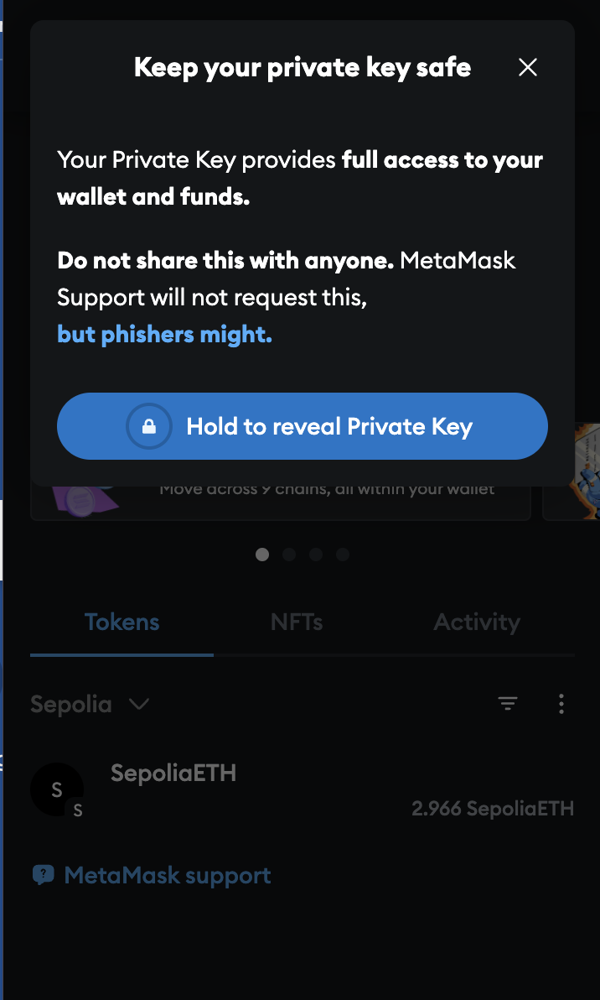

# Fossil Light Client - Technical Documentation

<div align="center">

<h1>🦴 Fossil Light Client</h1>

[](https://github.com/OilerNetwork/fossil-light-client/actions/workflows/cairo.yml)
[](https://github.com/OilerNetwork/fossil-light-client/actions/workflows/rust.yml)
[](http://www.apache.org/licenses/LICENSE-2.0)
[](https://ethereum.org/)
[](https://starknet.io/)
[](https://www.risczero.com/)

**A lightweight Ethereum client for Starknet with ZK-powered fee state proofs**

</div>

<hr />

## ✨ Key Features

- 🔗 **Cross-Chain Communication**: Securely relay Ethereum block headers to Starknet
- 🔒 **ZK-Powered Verification**: Use zero-knowledge proofs for efficient verification
- 📊 **Fee State Proofs**: Generate and verify cryptographic proofs of Ethereum gas fees
- 🚀 **Scalable Architecture**: Process Ethereum blocks in batches with MMR accumulation
- 🛠️ **Flexible Deployment**: Run via Docker or compile manually for development

## 🚀 Quick Start

```bash
# Clone the repository
git clone https://github.com/OilerNetwork/fossil-light-client.git
cd fossil-light-client

# Initialize submodules
git submodule update --init --recursive

# Start with Docker (recommended)
cp config/.env.example .env
cp config/.env.docker.example .env.docker
docker-compose up -d
```

<hr />

## 📑 Index

- [Fossil Light Client - Technical Documentation](#fossil-light-client---technical-documentation)
  - [✨ Key Features](#-key-features)
  - [🚀 Quick Start](#-quick-start)
  - [📑 Index](#-index)
  - [Prerequisites for All Users](#prerequisites-for-all-users)
  - [Documentation Setup](#documentation-setup)
  - [Docker-Based Deployment](#docker-based-deployment)
    - [Docker Prerequisites](#docker-prerequisites)
    - [Docker Accumulation Steps](#docker-accumulation-steps)
      - [Option 1: Using Local Development Network](#option-1-using-local-development-network)
      - [Option 2: Using Production Networks](#option-2-using-production-networks)
    - [Management Commands](#management-commands)
  - [Manual Compilation and Execution](#manual-compilation-and-execution)
    - [Manual Prerequisites](#manual-prerequisites)
    - [Setup and Execution](#setup-and-execution)
    - [Block Range Selection for Fee State Proofs](#block-range-selection-for-fee-state-proofs)
  - [Deploying the smart contracts manually](#deploying-the-smart-contracts-manually)
    - [Prerequisites](#prerequisites)
    - [RPC provider](#rpc-provider)
      - [Ethereum wallet (Metamask)](#ethereum-wallet-metamask)
      - [Starknet wallet (Starkli)](#starknet-wallet-starkli)
    - [Deploying the Ethereum Smart Contract](#deploying-the-ethereum-smart-contract)
    - [Deploying the Starknet Smart Contract](#deploying-the-starknet-smart-contract)
  - [Troubleshooting](#troubleshooting)
    - [Docker Issues](#docker-issues)
    - [Common Issues](#common-issues)
    - [Deploying to Sepolia Network](#deploying-to-sepolia-network)
      - [1. Configure Environment](#1-configure-environment)

This documentation outlines two deployment approaches for the Fossil Light Client:

1. 🐋 **Docker-Based Deployment**: Recommended for most users, handles all dependencies automatically
2. 🔧 **Manual Compilation**: For development and debugging, runs light client binaries from source

## Prerequisites for All Users

1. Clone the repository:

   ```bash
   git clone https://github.com/OilerNetwork/fossil-light-client.git
   cd fossil-light-client
   ```

2. Initialize repository:

   ```bash
   git submodule update --init --recursive
   ```

3. Install Yarn:
   - **For macOS:**

     ```bash
     # Using Homebrew
     brew install yarn

     # Using npm
     npm install --global yarn
     ```

   - **For Linux:**

     ```bash
     # Using npm
     npm install --global yarn

     # Using Debian/Ubuntu
     curl -sS https://dl.yarnpkg.com/debian/pubkey.gpg | sudo apt-key add -
     echo "deb https://dl.yarnpkg.com/debian/ stable main" | sudo tee /etc/apt/sources.list.d/yarn.list
     sudo apt update
     sudo apt install yarn
     ```

   - **For Windows:**

     ```bash
     # Using npm
     npm install --global yarn

     # Using Chocolatey
     choco install yarn

     # Using Scoop
     scoop install yarn
     ```

4. Install IPFS:
   - Download and install [IPFS Desktop](https://github.com/ipfs/ipfs-desktop/releases)
   - Ensure IPFS daemon is running before proceeding

5. Platform-specific requirements:
   - **For macOS users:**

     ```bash
     # Install Python toolchain and gettext
     brew install python
     brew install gettext
     
     # Add to ~/.zshrc or ~/.bash_profile:
     export PATH="/usr/local/opt/python/libexec/bin:$PATH"
     ```

   - **For Linux users:** No additional requirements

## Documentation Setup

To run the documentation locally:

```bash
cd docs/
yarn
yarn start
```

This will start a local server and open the documentation in your default browser. The documentation will automatically reload when you make changes to the source files.

## Docker-Based Deployment

> ⚠️ **Note**: Docker deployment is only supported on x86 architecture. Users with ARM-based machines (e.g., Apple M1/M2) should use the [Manual Compilation and Execution](#manual-compilation-and-execution) method.

### Docker Prerequisites

1. Install [Docker Desktop](https://www.docker.com/products/docker-desktop/) (includes Docker Engine and Compose)
2. For Linux only: Install Docker Buildx

   ```bash
   mkdir -p ~/.docker/cli-plugins/
   curl -L https://github.com/docker/buildx/releases/download/v0.12.1/buildx-v0.12.1.linux-amd64 -o ~/.docker/cli-plugins/docker-buildx
   chmod +x ~/.docker/cli-plugins/docker-buildx
   ```

### Docker Accumulation Steps

There are two main approaches for running the accumulation process:

#### Option 1: Using Local Development Network

This approach builds a local Ethereum and Starknet network for development and testing:

1. Set up configuration:

   ```bash
   cp config/.env.example .env
   cp config/.env.docker.example .env.docker
   ```

2. Build network containers:

   ```bash
   chmod +x scripts/build-network.sh
   ./scripts/build-network.sh
   ```

3. Start core infrastructure:

   ```bash
   docker-compose up -d
   docker-compose logs -f  # Monitor until initialization complete
   ```

4. Run MMR accumulation:

   ```bash
   # Run with default settings (build all batches until block #0)
   docker-compose -f docker-compose.accumulation.yml up

   # Or specify number of batches
   NUM_BATCHES=4 docker-compose -f docker-compose.accumulation.yml up
   ```

#### Option 2: Using Production Networks

This approach connects to existing Ethereum and Starknet networks:

1. Set up configuration:

   ```bash
   # For testnet (Sepolia)
   cp config/.env.local.example .env.sepolia
   
   # For mainnet
   cp config/.env.local.example .env.mainnet
   ```

2. Update the configuration file with:
   - Ethereum RPC endpoint
   - Starknet RPC endpoint
   - Contract addresses for deployed contracts
   - API keys and other required credentials

3. Run MMR accumulation:

   ```bash
   # For testnet (Sepolia)
   ENV_FILE=.env.sepolia docker-compose -f docker-compose.accumulation.yml up
   
   # For mainnet
   ENV_FILE=.env.mainnet docker-compose -f docker-compose.accumulation.yml up
   
   # Optionally specify number of batches
   ENV_FILE=.env.sepolia NUM_BATCHES=4 docker-compose -f docker-compose.accumulation.yml up
   ```

The Docker image `ametelnethermind/fossil-build-mmr:latest` will be automatically pulled from DockerHub, so no local build is required.

### Management Commands

```bash
# View containers
docker ps

# View logs
docker-compose logs -f
docker-compose -f docker-compose.accumulation.yml logs -f

# Stop everything
docker-compose down
docker-compose -f docker-compose.accumulation.yml down
```

## Manual Compilation and Execution

This setup uses Docker only for networks (Ethereum & StarkNet) and contract deployments, while running light client components directly with Cargo.

### Manual Prerequisites

1. Install Rust:

   ```bash
   curl --proto '=https' --tlsv1.2 -sSf https://sh.rustup.rs | sh
   ```

2. Install Risc0:

   ```bash
   curl -L https://risczero.com/install | bash && rzup
   ```

### Setup and Execution

1. Configure environment:

   ```bash
   cp config/.env.local.example .env.local
   ```

2. Start networks and deploy contracts:

   ```bash
   chmod +x scripts/build-network.sh
   ./scripts/build-network.sh
   ```

   **Option 1: Standard deployment (with container build)**

   ```bash
   docker-compose up
   ```

   **Option 2: Faster deployment (build locally first)**

   To save time during network container bootup, you can build the Starknet contracts locally before running docker-compose:

   ```bash
   # Build Starknet contracts locally
   cd contracts/starknet
   scarb build
   cd ../..
   
   # Run docker-compose with NO_BUILD=1 to skip the build step in the container
   NO_BUILD=1 docker-compose up
   ```

   Wait for the `deploy-starknet` container to complete the deployment of all StarkNet contracts. The deployment is finished when you see a log message indicating environment variables have been updated. (it might take a few minutes)

3. Build the project:

   ```bash
   cargo build
   ```

4. Build MMR and generate proofs:
   This step will:
   - Start from the latest Ethereum finalized block and process 8 blocks backwards (2 batches * 1024 blocks)
   - Generate a ZK proof of computation for each batch
   - Create and store .db files for each MMR batch and upload them to IPFS
   - Generate and verify Groth16 proofs on StarkNet for batch correctness
   - Extract batch state from proof journal and store it in the Fossil Store contract

   ```bash
   cargo run --bin build-mmr -- --num-batches 2 --env-file .env.local
   ```

5. Start the relayer:
   This step will:
   - Monitor the latest finalized block on Ethereum
   - Call the L1 contract to relay the finalized block hash to Starknet
   - Automatically retry on failures and continue monitoring
   - Run as a background service with configurable intervals (default: 3 minutes for local testing)

   ```bash
   chmod +x scripts/run_relayer_local.sh
   ./scripts/run_relayer_local.sh
   ```

6. Start the client:
   This step will:
   - Monitor the Fossil Store contract on Starknet for new block hash events
   - Upon receiving a new block hash:
     - Fetch block headers from the latest MMR root up to the new block hash
     - Update the local light client state with the new block headers
     - Verify the cryptographic proofs for each block header
   - Maintain a recent block buffer to handle potential chain reorganizations

   ```bash
   cargo run --bin client -- --env-file .env.local
   ```

7. Test Fee Proof Fetching:
   In a new terminal, fetch the fees for a block range from the Fossil Store contract:

   ```bash
   starkli call <fossil_store_contract_address> get_avg_fees_in_range <start_timestamp> <end_timestamp> --rpc http://localhost:5050
   ```

   Note: The block range should match the blocks that were added to the MMR in step 4. You can find these numbers in the build_mmr output logs.

### Block Range Selection for Fee State Proofs

When requesting state proofs for fees, you can query any hour-aligned timestamp or range within the processed blocks. The system aggregates fees hourly and requires timestamps to be multiples of 3600 seconds (1 hour).

For example, if blocks from timestamp 1704067200 (Jan 1, 2024 00:00:00 UTC) to 1704153600 (Jan 2, 2024 00:00:00 UTC) have been processed:

- You can query a single hour: 1704070800 (Jan 1, 2024 01:00:00 UTC)
- Or a range: 1704067200 to 1704153600 (full 24 hours)
- Or any subset of hours within these bounds

Key validation rules:

- All timestamps must be hour-aligned (multiples of 3600 seconds)
- For range queries, start timestamp must be ≤ end timestamp
- Queries return weighted average fees based on number of blocks in each hour

Note: While blocks are processed in batches internally, fee queries operate on hour boundaries regardless of batch structure.


## Deploying the smart contracts manually

There's multiple contracts that needs to be deployed on Ethereum and Starknet in order for the light client to work, namely:

1. L1 Message Sender (Ethereum)
2. Fossil Store (Starknet)
3. L1 Message Proxy (Starknet)
4. Groth16 Verifier (Starknet)
5. Fossil Verifier (Starknet)

The deployment instructions above includes the contract deployment steps, however in cases where you want to deploy to different networks the following will be useful.

We will be deploying to sepolia in the following guide, but the steps should be similar for any network you would want to deploy to.

### Prerequisites

Make sure you have the following installed on your machine.

1. foundry (https://book.getfoundry.sh/getting-started/installation)
2. starkli (https://book.starkli.rs/installation)

You'll need both Ethereum and Starknet wallets for deployment. We'll use MetaMask and Starkli.


Create a new and empty `.env.sepolia` file:

```bash
ETH_RPC_URL=
STARKNET_RPC_URL=

ACCOUNT_PRIVATE_KEY=

STARKNET_ACCOUNT=
STARKNET_ACCOUNT_ADDRESS=
```

We will fill these as we proceed.


### RPC provider

In order to deploy our contracts, we'll need a RPC provider. You can use any providers that you might prefer, here we'll be using Alchemy for both Ethereum and Starknet Sepolia. Add the RPC endpoints into your `.env.sepolia` file, which should look like this:


```bash
ETH_RPC_URL=https://eth-sepolia.g.alchemy.com/v2/xxxxxx # replace xxxxxx with your api key
STARKNET_RPC_URL=https://starknet-sepolia.g.alchemy.com/starknet/version/rpc/v0_7/xxxxxx # replace xxxxxx with your api key
```

#### Ethereum wallet (Metamask)

For metamask, you'll have to download the metamask web extension at https://metamask.io/download. After downloading, follow all the step to create the wallet, and make sure you save the seed phrase somewhere safe.

You should be able to get the private key from your wallet like so:

First, click the top right corner button, and navigate to account details.



Then, click on show private key. Make sure you are in a safe place when doing this, as private keys allows anyone that have it to get full access to your wallet.


Finally, you might get a password prompt, and after that you should be able to obtain your private key. You might be told to hold to reveal keys like what is shown below.



Copy your key, and put the value into your `.env.sepolia` file.


```bash
ACCOUNT_PRIVATE_KEY=0x01234456 #replace this with your actual private key.
```

> Note: The deployment scripts require a bash shell. Windows users should use WSL or a bash emulator.


#### Starknet wallet (Starkli)


To create a new wallet:

```bash
starkli account oz init deploy_wallet
```
You should see something like:

```bash
Created new account config file: ~/deploy_wallet

Once deployed, this account will be available at:
    0x00ecac1256b0f48686dd90819299537d3bd2a8fc192402b926d3eff516307f87

Deploy this account by running:
    starkli account deploy deploy_wallet
```

There should be a wallet file called `deploy_wallet` in the directory you are running the command at.

To deploy your wallet:

```bash
starkli account deploy deploy_wallet
```

You should see the following:

```bash
WARNING: you're not specifying a fee token and ETH is automatically used. The default token will change to STRK in the next breaking release.
WARNING: paying transaction fees in ETH is deprecated and will soon be disabled on Starknet. Consider using STRK for fees instead.
WARNING: you're using neither --rpc (STARKNET_RPC) nor --network (STARKNET_NETWORK). The `sepolia` network is used by default. See https://book.starkli.rs/providers for more details.
The estimated account deployment fee is 0.000000017000007390 ETH. However, to avoid failure, fund at least:
    0.000000025500011085 ETH
to the following address:
    0x00ecac1256b0f48686dd90819299537d3bd2a8fc192402b926d3eff516307f87
Press [ENTER] once you've funded the address.
```

Now transfer some funds to this address. You can use any available Starknet faucet to transfer the funds to this address. You can also bridge over your Eth from Ethereum Sepolia to Starknet Sepolia. Once you transferred the amount you should press enter, and after a short while you should see the following:

```bash
Account deployment transaction: 0x0509406df7ec727ac24a5e29a564e3703e2cb32b19910fde3e7067a33462dd80
Waiting for transaction 0x0509406df7ec727ac24a5e29a564e3703e2cb32b19910fde3e7067a33462dd80 to confirm. If this process is interrupted, you will need to run `starkli account fetch` to update the account file.
Transaction not confirmed yet...
Transaction 0x0509406df7ec727ac24a5e29a564e3703e2cb32b19910fde3e7067a33462dd80 confirmed
```

Now that you have the account setup and deployed, you have to add the following to your `.env.sepolia` file.

```bash
STARKNET_ACCOUNT=deploy_wallet # replace this with the path to your account file.
STARKNET_ACCOUNT_ADDRESS=0x00ecac1256b0f48686dd90819299537d3bd2a8fc192402b926d3eff516307f87
```

> For more detailed information on this step, you should also refer to https://book.starkli.rs/accounts


Your `.env.sepolia` file at this point should look like this:

```bash
ETH_RPC_URL=https://eth-sepolia.g.alchemy.com/v2/xxxxxx # replace xxxxxx with your api key
STARKNET_RPC_URL=https://starknet-sepolia.g.alchemy.com/starknet/version/rpc/v0_7/xxxxxx # replace xxxxxx with your api key

ACCOUNT_PRIVATE_KEY=0x01234456 #replace this with your actual private key.

STARKNET_ACCOUNT=deploy_wallet # replace this with the path to your account file.
STARKNET_ACCOUNT_ADDRESS=0x00ecac1256b0f48686dd90819299537d3bd2a8fc192402b926d3eff516307f87
```


### Deploying the Ethereum Smart Contract

Before starting deployment to sepolia, we also have to additionally provide the Starknet messaging contract in the `.env.sepolia` file in order to actually get the L1 messaging contract working as expected.

```bash
ETH_RPC_URL=https://eth-sepolia.g.alchemy.com/v2/xxxxxx # replace xxxxxx with your api key
STARKNET_RPC_URL=https://starknet-sepolia.g.alchemy.com/starknet/version/rpc/v0_7/xxxxxx # replace xxxxxx with your api key

ACCOUNT_PRIVATE_KEY=0x01234456 #replace this with your actual private key.

STARKNET_ACCOUNT=deploy_wallet # replace this with the path to your account file.
STARKNET_ACCOUNT_ADDRESS=0x00ecac1256b0f48686dd90819299537d3bd2a8fc192402b926d3eff516307f87

# Starknet L1 contract
SN_MESSAGING=0xE2Bb56ee936fd6433DC0F6e7e3b8365C906AA057 # <--- Add this
```

With the RPC & Wallet setup, you can now deploy your contract. You can start deployment by doing the following:

```bash
chmod +x ./scripts/deploy-ethereum.sh

./scripts/deploy-ethereum.sh sepolia
```

This should run the deployment script, and if nothing goes wrong the contract should deploy successfully and you'll see your `.env.sepolia` gets updated with the following:

```bash
ETH_RPC_URL=https://eth-sepolia.g.alchemy.com/v2/xxxxxx # replace xxxxxx with your api key
STARKNET_RPC_URL=https://starknet-sepolia.g.alchemy.com/starknet/version/rpc/v0_7/xxxxxx # replace xxxxxx with your api key

ACCOUNT_PRIVATE_KEY=0x01234456 #replace this with your actual private key.

STARKNET_ACCOUNT=deploy_wallet # replace this with the path to your account file.
STARKNET_ACCOUNT_ADDRESS=0x00ecac1256b0f48686dd90819299537d3bd2a8fc192402b926d3eff516307f87

# Starknet L1 contract
SN_MESSAGING=0xE2Bb56ee936fd6433DC0F6e7e3b8365C906AA057

L1_MESSAGE_SENDER=0xc0951D2b252D68D786465D5f7E87e68E5c0376Aa # <--- this will be different from you
```


### Deploying the Starknet Smart Contract

Make sure you have successfully deployed the Ethereum smart contracts before proceeding, as the following steps will fail without the contract addresses from the previous step.

Deploying the Starknet Smart Contract is also similar.

```bash
chmod +x ./scripts/deploy-starknet.sh

./scripts/deploy-starknet.sh sepolia
```

If nothing goes wrong, you should get an updated `.env.sepolia` file with the addresses for the deployed contracts.

```bash
ETH_RPC_URL=https://eth-sepolia.g.alchemy.com/v2/xxxxxx # replace xxxxxx with your api key
STARKNET_RPC_URL=https://starknet-sepolia.g.alchemy.com/starknet/version/rpc/v0_7/xxxxxx # replace xxxxxx with your api key

ACCOUNT_PRIVATE_KEY=0x01234456 #replace this with your actual private key.

STARKNET_ACCOUNT=deploy_wallet # replace this with the path to your account file.
STARKNET_ACCOUNT_ADDRESS=0x00ecac1256b0f48686dd90819299537d3bd2a8fc192402b926d3eff516307f87

# Starknet L1 contract
SN_MESSAGING=0xE2Bb56ee936fd6433DC0F6e7e3b8365C906AA057

L1_MESSAGE_SENDER=0xc0951D2b252D68D786465D5f7E87e68E5c0376Aa

# The following should be added, probably with different values
L2_MSG_PROXY=0x0789ad53a5ebfdfa08d666fdf002fa79125fe52f183826a4ef0389ba3f6f7e07
FOSSIL_STORE=0x0018e2c4f0f8523ed44aea7808ba837c783999f6260fffad3752d41a7371a298
STARKNET_VERIFIER=0x059a5236330a7a8e6aa13fd2191107d5afa7980cfe274e36bb1068bbba310eda
FOSSIL_VERIFIER=0x015efdffa827a7971eab94869249d5bdc291ddc97e1364b74c55462e4f9a5940
```

Congrats! You now have all the contracts deployed on Sepolia testnet!


## Troubleshooting

### Docker Issues

- Reset deployment:

  ```bash
  docker-compose down
  docker-compose -f docker-compose.accumulation.yml down
  docker network rm fossil-network
  ```

- Remove orphaned containers:

  ```bash
  docker-compose up -d --remove-orphans
  ```

### Common Issues

- Ensure IPFS daemon is running
- Verify Docker network connectivity
- Check logs: `docker-compose logs -f`

### Deploying to Sepolia Network

This section guides you through deploying the Fossil Light Client to the Sepolia testnet.

#### 1. Configure Environment

First, create and configure your Sepolia environment file:

```bash
# Copy the example configuration
cp config/.env.local.example .env.sepolia

# Edit the file with your specific configuration
nano .env.sepolia
```

Ensure these variables are properly set in your `.env.sepolia` file:

- `ETH_RPC_URL`: Your Sepolia Ethereum RPC endpoint
- `ACCOUNT_PRIVATE_KEY`: Private key for deployment
- `SN_MESSAGING`: Starknet core messaging contract address
- `